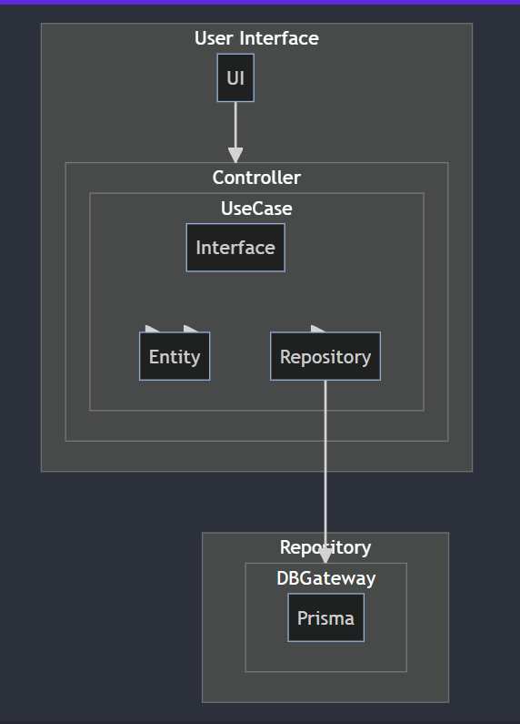
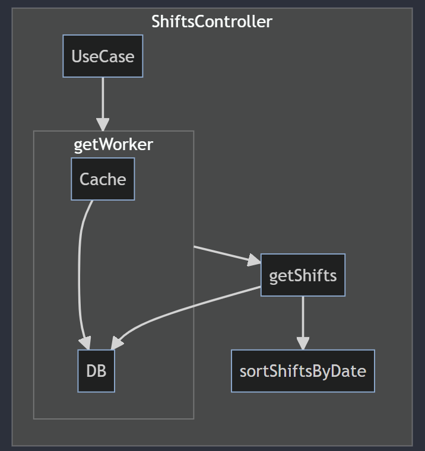
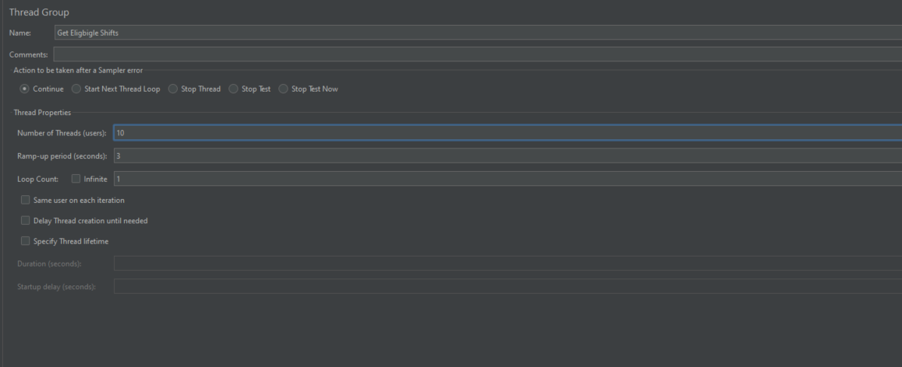
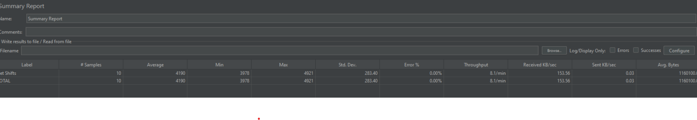

## Description

The project follows a clean architecture approach to resolve the challenge.

`open-shift/src/app/use-cases/get-eligible-shifts.ts` is the useCase proposed on the challenge. The useCase it's called by the controller
`open-shift/src/infra/http/controllers/shifts.controller.ts`.

The useCase does the magic to understand what is needed for the use case based on the business need. For DB access, clean architecture decouples it. So we have abstract declarations in repositories
`open-shift/src/app/repositories/ShiftRepository.ts`. The actual implementation is divided by what data solutions is being used. For this challenge, we are using Prisma.
`open-shift/src/infra/database/prisma/repositories/prisma-shift-repository.ts`.

Here on Figure 1, we have an image illustrating the clean architecture.



And Figure 2 illustrate the actual process of the query to get the worker's eligible shifts.



Basically works as the following:

- Controller receives the request and call the useCase
- UseCase first looks for the Worker on the cache, if the worker is not cached, it looks on the DB.
- If worker is not active, returns.
- If worker is active, looks for the eligible shifts on the DB
- With the shifts, the use orts the shifts by date and returns to the user.

# Running locally

## Installation

```bash
$ yarn install
```

## Setup DB

Add the DATABASE_URL to ´prisma/.env`

## Running the app

```bash
# development
$ yarn run start

# watch mode
$ yarn run start:dev

# production mode
$ yarn run start:prod
```

## Test

```bash
# unit tests
$ yarn run test
```

# Running on Docker

## Setup DB

- Add the DATABASE_URL to ´prisma/.env`
- Make sure the network on docker-compose.yml is setup properly

## Run dev

make dev

## Run test

make run-test

## Jmeter results

Executed locally a Jmeter to understand the api performance. Although some variables can't be corrected easily in a local environment, for instance DB memory, it's a good metric to understand a little of the API performance. Figure 3 shows the configuration and Figure 4 a Summary Report.




